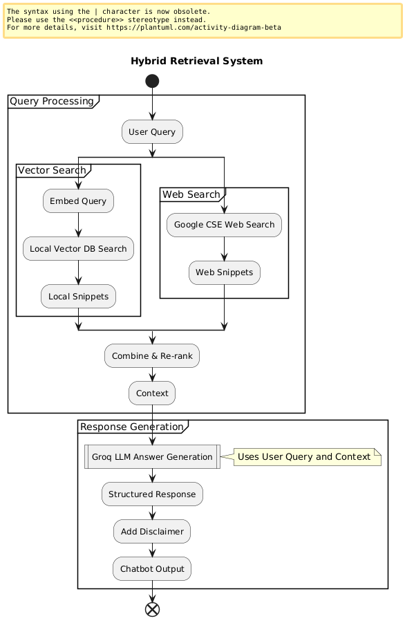

# RAG-Powered First-Aid Chatbot (Groq & Google CSE)


This project is a high-performance, retrieval-augmented generation (RAG) chatbot designed to provide immediate, scannable first-aid guidance for medical emergencies within the domains of **Diabetes, Cardiac, and Renal health**.

It leverages the incredible speed of the **Groq API** for large language model (LLM) inference and **Google Custom Search Engine (CSE)** for real-time web retrieval, all while operating within free-tier limits for demonstration and screening purposes.

⚠️ **Disclaimer:** This application is for educational and demonstration purposes only. It is **not a substitute for professional medical advice, diagnosis, or treatment**. In case of a real medical emergency, **call emergency services immediately**.

---

## ✨ Key Features

*   **⚡ High-Performance LLM:** Utilizes the Groq API (with models like Llama 3) for exceptionally fast, real-time responses.
*   **🌐 Hybrid Retrieval:** Combines a curated, local knowledge base (via FAISS) with live web search results from Google CSE to provide comprehensive and up-to-date information.
*   **🎯 Advanced Re-ranking:** Employs a `cross-encoder` model to intelligently re-rank all retrieved documents, ensuring the most relevant information is passed to the LLM.
*   **🛡️ Safety-First Design:** All responses are prefaced with a clear medical disclaimer, and the system prompt is engineered to prioritize critical safety actions (e.g., "call emergency services").
*   **📚 Citable & Grounded Answers:** The RAG architecture ensures that the LLM's responses are grounded in the retrieved context. Each answer includes citations, pointing to the local or web source used.

---

## 🏗️ Architecture

The chatbot follows a standard RAG pipeline:

1.  **User Query:** The user inputs their medical symptoms or question.
2.  **Hybrid Retrieval:**
    *   **Local Search:** A `sentence-transformer` model embeds the query and searches a local FAISS vector index of trusted medical snippets.
    *   **Web Search:** The query is simultaneously sent to the Google Custom Search API to retrieve relevant web pages.
3.  **Re-ranking:** All retrieved documents (from both local and web sources) are passed to a `cross-encoder` model, which re-ranks them based on their relevance to the original query.
4.  **Context Formulation:** The top N re-ranked documents are selected and formatted into a context block.
5.  **LLM Generation:** The user query and the context block are sent to the Groq API. The LLM (e.g., Llama 3) generates a structured, safety-aware response based on the provided information.
6.  **Final Response:** The formatted answer, including the disclaimer and source citations, is returned to the user.




---

## 🛠️ Tech Stack

*   **LLM Inference:** [Groq API](https://groq.com/) (Llama 3, Mixtral)
*   **Web Retrieval:** [Google Custom Search Engine API](https://programmablesearchengine.google.com/)
*   **Vector Search:** [FAISS](https://github.com/facebookresearch/faiss) (from Meta AI)
*   **Embeddings & Re-ranking:** `sentence-transformers` library
*   **Backend:** Python
*   **Environment Management:** `python-dotenv`

---

## ⚙️ Getting Started

Follow these steps to set up and run the project locally.

### 1. Clone the Repository

```sh
git clone https://github.com/Manoj010104/emplay_assignment.git
cd emplay_assignment
```

### 2. Obtain API Keys

You will need three API credentials.

*   **Groq API Key:**
    1.  Go to [console.groq.com](https://console.groq.com).
    2.  Sign up or log in.
    3.  Navigate to **API Keys** and create a new key. Copy it.

*   **Google Cloud API Key (for CSE):**
    1.  Go to the [Google Cloud Console](https://console.cloud.google.com/).
    2.  Create or select a project.
    3.  In the search bar, find and enable the **"Custom Search API"**.
    4.  Go to **APIs & Services > Credentials**.
    5.  Click **CREATE CREDENTIALS > API Key**. Copy it.

*   **Google Custom Search Engine (CSE) ID:**
    1.  Go to the [Programmable Search Engine control panel](https://cse.google.com/cse/all).
    2.  Click **Add** to create a new search engine.
    3.  In "Sites to search", you can put `webmd.com` or any major health site.
    4.  Under the "Basics" tab, ensure **"Search the entire web" is turned ON**. This is crucial.
    5.  Copy the **"Search engine ID"** (it starts with `cx`).

### 3. Configure Environment Variables

Create a file named `.env` in the root of the project directory. Paste your keys into it like this:

```
# .env
GROQ_API_KEY="your_groq_api_key_here"
GOOGLE_CSE_API_KEY="your_google_cloud_api_key_here"
GOOGLE_CSE_ID="your_google_custom_search_engine_id_here"
```
**Important:** Ensure `.env` is listed in your `.gitignore` file to avoid committing your secret keys.

### 4. Install Dependencies

It is highly recommended to use a Python virtual environment.

```sh
# Create a virtual environment
python -m venv venv

# Activate it
# On Windows:
venv\Scripts\activate
# On macOS/Linux:
source venv/bin/activate

# Install the required packages
pip install -r requirements.txt
```

---

## 🚀 Running the Chatbot

Once the setup is complete, run the main application from the project's root directory:

```sh
python main.py
```

The chatbot will initialize all models and prompt you for input.

### Example Interaction

```
Your symptoms: crushing chest pain shooting down my left arm

Processing your request...

--- Chatbot's First-Aid Guidance ---
Disclaimer: This information is for educational purposes only and is not a substitute for professional medical advice. Always consult a healthcare professional for diagnosis and treatment. In case of a medical emergency, call emergency services immediately.
---
Condition: Myocardial Infarction (Heart Attack)
First-Aid Steps:
1. Call emergency services immediately. This is the absolute priority.
2. Have the person sit down and rest to reduce the heart's workload.
3. If the person has been prescribed nitroglycerin, assist them in taking it as directed.
4. If they are not allergic and have no contraindications, offer a chewable aspirin (160-325 mg) to help prevent blood clotting.
Key Medicine(s): Aspirin (chewable, 160-325 mg), Nitroglycerin (sublingual, if prescribed).
Source Citations:
- [Local Snippet: "Sudden chest pain radiating to the left arm may indicate myocardial infarction."]
- [Local Snippet: "Call emergency services immediately at the first suspicion of heart attack."]
- [Web: Mayo Clinic - Heart Attack First Aid (https://www.mayoclinic.org/...)]
---
```

---

## 🧪 Testing

The project includes a suite of functional tests using `pytest`. These tests run predefined queries against the live chatbot to validate the structure and content of its responses.

To run the tests, execute the following command from the root directory:

```sh
pytest tests/test_chatbot.py
```
